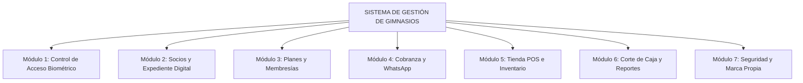

# 🏋️ Dossier Ejecutivo Comercial — Sistema de Control y Gestión Integral de Gimnasios
### *Plataforma Todo-en-Uno para Administración, Control Biométrico de Acceso, Membresías y Punto de Venta*

**Desarrollado por:** Solución Digital 360  
**Canal Oficial de Demostración:** [@SoluciónDigital360 en YouTube](https://www.youtube.com/@SoluciónDigital360)  
**Modalidad de Licencia:** Vitalicia (Pago Único — Sin Rentas Mensuales)  
**Compatibilidad:** Windows 10 / Windows 11 (64 bits) | Modo Offline Autónomo  

---

## 🌟 1. Presentación Ejecutiva y Propuesta de Valor

El **Sistema de Control y Gestión de Gimnasios** es una solución de software empresarial diseñada específicamente para resolver los tres dolores de cabeza más críticos de cualquier centro fitness o club deportivo:
1. **La fuga de ingresos por socios morosos** que siguen ingresando sin pagar.
2. **El descontrol en recepción y tiempos muertos** al registrar asistencias y cobrar visitas de día.
3. **El desorden en la venta de suplementos, bebidas y accesorios**, con mermas y cajas que no cuadran.

A diferencia de las plataformas SaaS que exigen pagos mensuales de por vida y quedan inservibles si se cae la conexión a internet, nuestro sistema opera **100% de forma local y autónoma**, con tecnología de grado bancario, compatibilidad universal con lectores biométricos USB, y una interfaz visual de última generación inspirada en aplicaciones fitness de alto impacto.

---

## 🏆 2. Resumen de Ventajas Competitivas para el Dueño del Gimnasio

| Ventaja Estratégica | Beneficio Inmediato |
|---------------------|---------------------|
| 💰 **Cero Mensualidades** | Licencia vitalicia de pago único. El software es de tu propiedad, ahorrándote miles de pesos/dólares al año en suscripciones. |
| ⚡ **Operación 100% Offline** | Tu gimnasio nunca se detiene. No dependes de internet para registrar huellas, checar entradas ni cobrar ventas en recepción. |
| 🛡️ **Tolerancia Cero a Morosidad** | El sistema valida vigencias en milisegundos y bloquea accesos no autorizados con alertas visuales inmediatas. |
| 👆 **Biometría Universal Plug & Play** | Conecta cualquier lector de huellas USB (ZKTeco, DigitalPersona, SecuGen, Eikon o lectores integrados) sin pagar costosos SDKs adicionales. |
| 🛒 **Punto de Venta POS + E-Commerce** | Maximiza tus ingresos vendiendo proteínas, creatinas, agua y ropa deportiva con arqueo de caja exacto al centavo. |
| 📲 **Cobranza por WhatsApp en 1 Clic** | Envía recordatorios automáticos de pago a los socios directamente a su WhatsApp sin tener que redactar mensajes manuales. |
| 🎨 **6 Temas Visuales y Marca Propia** | Personaliza el sistema con el logotipo de tu gimnasio, tickets térmicos a tu medida y colores corporativos a tu gusto. |
| 🖥️ **Ventana de Escritorio Nativa** | Se ejecuta como una app nativa de escritorio limpia y ultrarrápida (estilo app moderna, sin barras estorbosas de navegador). |

---

## 🧩 3. Desglose Exhaustivo de Módulos y Funcionalidades

---

### 🔹 MÓDULO 1: Control de Acceso Biométrico y Registro de Visitas
*El corazón de la recepción. Rapidez absoluta para evitar filas en horas pico.*

- **Reconocimiento Biométrico Instantáneo:** Identificación en menos de 0.5 segundos utilizando el motor matemático **SourceAFIS** con algoritmos 1:1 y 1:N.
- **Soporte de Hardware Universal (Hot-Plug):** Compatible con lectores USB ZKTeco (ZK9500, ZK4500), DigitalPersona (U.are.U 4500, 5100), SecuGen, Eikon y sensores biométricos nativos de Windows Hello. Detecta el hardware al conectarlo sin reiniciar el sistema.
- **Semáforo Visual en Pantalla de Recepción:**
  - 🟢 **Acceso Autorizado (Verde):** Membresía vigente, muestra foto del socio, nombre y días restantes.
  - 🟡 **Próximo a Vencer (Amarillo):** Acceso permitido con aviso recordatorio en pantalla ("Le restan 3 días").
  - 🔴 **Acceso Denegado (Rojo):** Membresía vencida o socio sin plan asignado. Bloqueo inmediato.
- **Prevención de Doble Entrada (Anti-Passback):** Detecta si un socio ya realizó check-in en el día, impidiendo que presten credenciales o dupliquen entradas por error.
- **Acceso Multimodal:** Si el socio presenta dificultades en la huella (piel húmeda, callosidades), puede registrar su asistencia mediante **teclado numérico con PIN personal** o escaneo de credencial con código de barras/QR.
- **Control de Visitas Diarias (No Socios):** Botón express para cobrar e ingresar "Pase del Día" a clientes esporádicos, asignando folio y sumando el monto en la caja del día.

---

### 🔹 MÓDULO 2: Gestión de Socios y Expediente Digital
*Control total de cada usuario desde su primer día de inscripción.*

- **Alta en Menos de 1 Minuto:** Formulario dinámico para registrar nombres, apellidos, teléfono, domicilio, fecha de nacimiento y notas médicas/de contacto.
- **Captura Fotográfica en Vivo con Webcam:** Toma la foto del socio directamente desde la cámara web de tu PC/laptop en alta resolución con previsualización en vivo, o sube una imagen existente.
- **Enrolamiento Biométrico Guiado:** Asistente interactivo con barra de calidad de lectura que guía al recepcionista para registrar la huella digital en pocos segundos.
- **Asignación de Membresía Inmediata (Inline):** Asigna el plan inicial y cobra la primera mensualidad en el mismo flujo de registro sin saltar entre diferentes ventanas.
- **Ficha 360° del Cliente:** Consulta historial completo de asistencias, pagos realizados, fechas de vigencia y productos comprados en la tienda.
- **Buscador Inteligente Reactivo:** Filtra socios al instante por nombre, folio, teléfono o estado de cuenta (Activo, Vencido, Por Vencer).

---

### 🔹 MÓDULO 3: Catálogo de Planes y Membresías Flexibles
*Adapta tus tarifas a cualquier modelo de negocio deportivo.*

- **Configuración de Planes Sin Límites:** Crea planes por día, semana, quincena, mes, bimestre, trimestre, semestre, año o períodos especiales de temporada.
- **Duración en Días Calendario o Meses Exactos:** Soporta vigencias estrictas para retos fitness (ej. 21 días, 45 días) o membresías estándar mensuales.
- **Tarifas Diferenciadas:** Planes para estudiantes, parejas, horario matutino, pases VIP o pases corporativos.
- **Cálculo Inteligente de Vigencias:** Al renovar una membresía activa, el sistema suma la nueva vigencia a partir del vencimiento actual, sin robarle días al socio.
- **Control de Estado de Planes:** Activa o desactiva paquetes promocionales con un solo interruptor.

---

### 🔹 MÓDULO 4: Cobranza, Pagos y Notificaciones por WhatsApp
*Flujo de efectivo garantizado y comunicación directa con tus clientes.*

- **Registro Rápido de Pagos:** Cobra mensualidades, reinscripciones o penalizaciones con cálculo automático de totales.
- **Múltiples Métodos de Cobro:**
  - 💵 Efectivo (con calculadora de cambio).
  - 💳 Tarjeta de Débito / Crédito (registro de número de autorización).
  - 🏦 Transferencia bancaria SPEI (registro de folio bancario).
- **Impresión de Tickets Térmicos:** Emisión automática o bajo demanda de comprobantes en impresoras térmicas de 58mm y 80mm con logo del gimnasio, desglose y mensaje personalizado.
- **Botón Directo de WhatsApp para Cobranza:** Alerta con 1 solo clic a los socios próximos a vencer o vencidos con un mensaje personalizado pre-redactado que incluye su nombre y fecha exacta de corte.
- **Exportación de Movimientos:** Descarga historiales de cobro en formato CSV compatible con Microsoft Excel y Google Sheets.

---

### 🔹 MÓDULO 5: Tienda & Punto de Venta E-Commerce (POS v2.2)
*Diseñado como una tienda online moderna para disparar tus ventas de mostrador.*

- **Interfaz Visual E-Commerce:** Catálogo con tarjetas estilizadas, badges automáticos (`⚡ Más vendido`, `⚠️ Stock bajo`, `Agotado`) y gráficos vectoriales de alta definición por categoría.
- **Categorías de Productos Integradas:**
  - 🥤 Bebidas e Hidratación (Agua, isotónicos, energizantes).
  - 💊 Suplementación (Proteínas, creatinas, pre-entrenos, aminoácidos).
  - 👕 Ropa Deportiva (Playeras, licras, gorras, sudaderas).
  - 🏋️ Accesorios y Equipo (Guantes, cinturones, straps, shakers).
- **Buscador Rápido con Atajo `Ctrl + K`:** Encuentra cualquier artículo por nombre o código de barras sin usar el ratón.
- **Carrito de Compras Reactivo:** Ajuste de unidades con validación de existencia en tiempo real, descuentos aplicables y totalizado instantáneo.
- **Checkout con Calculadora de Efectivo:** Botones de denominaciones rápidas ($50, $100, $200, $500, $1,000, Exacto) y bloqueo de seguridad que impide cerrar la venta si el monto entregado es insuficiente.
- **Gestión de Inventario y Kardex:** Control de stock actual, stock mínimo para alertas tempranas, precio de costo y precio de venta al público.

---

### 🔹 MÓDULO 6: Arqueo de Caja, Cortes y Reportes Financieros
*Transparencia absoluta para los dueños: ni un solo peso sin registrar.*

- **Dashboard Principal en Tiempo Real:** Métricas clave al iniciar sesión (Socios activos, Ingresos del día, Visitas registradas, Socios por vencer).
- **Corte de Caja Diario (Arqueo X/Z):**
  - Unifica en un solo reporte los ingresos de: **Membresías + Ventas de Tienda + Visitas de Día**.
  - Desglose exacto por método de pago (Efectivo vs. Tarjeta vs. Transferencia) para conciliar la caja chica en menos de 3 minutos.
- **Corte Mensual Consolidado:** Evalúa el crecimiento mes a mes, ingresos históricos y comportamiento estacional del gimnasio.
- **Reporte Detallado de Asistencias:** Auditoría de flujo de socios por rangos de fecha y horas pico para planificar clases y entrenadores.
- **Exportación Completa a CSV / Excel:** Lleva tus datos contables a cualquier software externo con un solo clic.

---

### 🔹 MÓDULO 7: Configuración de Marca, Seguridad y Modo Autónomo
*Un sistema hecho a la medida de tu identidad comercial.*

- **6 Temas de Color Corporativos Dinámicos:**
  - 🔷 **Cian Neón (`Cyan`):** Look tecnológico y moderno.
  - 🟢 **Esmeralda (`Emerald`):** Fresco y dinámico.
  - 🔥 **Naranja Fuego (`Orange`):** Enérgico y motivador.
  - 🟣 **Púrpura Eléctrico (`Purple`):** Vanguardista y premium.
  - 🔴 **Rojo Pasión (`Red`):** Agresivo e intenso para crossfit y boxeo.
  - 🟡 **Oro Deportivo (`Gold`):** Elegante y exclusivo.
- **Personalización de Marca:** Sube el logo oficial de tu gimnasio, nombre comercial, dirección, teléfono y leyendas personalizadas para tickets y pantalla principal.
- **Seguridad Multiusuario y Roles:** Perfiles de acceso diferenciados (Recepcionista vs. Administrador / SuperAdmin) con encriptación de contraseñas de estándar bancario (BCrypt).
- **Modo Aplicación de Escritorio Aislado:** Acceso directo desde el Escritorio de Windows con icono personalizado. Abre en una ventana limpia sin marcos de navegador, optimizando la concentración del personal.
- **Base de Datos Dual (SQLite Autónomo / MySQL):** Listo para usar sin instalar XAMPP ni motores pesados. Base de datos autocontenida ultra segura y respaldable en un solo archivo.
- **Módulo de Copias de Seguridad:** Genera respaldos completos de tu información en un clic para almacenarlos en memorias USB o la nube.

---

## 💻 4. Especificaciones Técnicas y Compatibilidad de Hardware

| Componente | Requerimiento Recomendado |
|------------|---------------------------|
| **Sistema Operativo** | Windows 10 / Windows 11 (64 bits) |
| **Procesador** | Intel Core i3 / AMD Ryzen 3 o superior |
| **Memoria RAM** | 4 GB mínimo (8 GB recomendado para multitarea fluida) |
| **Almacenamiento** | 500 MB de espacio disponible en disco (SSD recomendado) |
| **Lectores Biométricos** | ZKTeco ZK9500, ZK4500, DigitalPersona U.are.U 4500/5100, SecuGen, Eikon o lectores integrados en laptop |
| **Cámaras Web** | Cualquier cámara USB estándar o integrada de 720p / 1080p |
| **Impresoras de Tickets** | Miniprinters térmicas de 58mm o 80mm (USB, Bluetooth o Red) |
| **Escáneres Adicionales** | Lector de código de barras USB / QR (emulación de teclado) |
| **Conexión a Red** | 100% Offline (No requiere conexión a internet para operar) |

---

## ❓ 5. Preguntas Frecuentes de Clientes (FAQ Comercial)

#### 1. ¿El pago de la licencia es único o tendré que pagar mensualidades después?
> **Es un pago único definitivo (Licencia Vitalicia).** No cobramos anualidades, mensualidades ni comisiones por transacción. El software funciona de manera permanente en tu equipo.

#### 2. ¿Qué pasa si no tengo conexión a internet en el gimnasio?
> El sistema funciona **100% de manera local y offline**. Tus socios podrán checar su huella, comprar productos y pagar su mensualidad sin depender del internet.

#### 3. ¿Puedo probar el sistema antes de comprarlo?
> **Sí, totalmente gratis.** Te proporcionamos una versión de prueba funcional durante 3 a 7 días con todas las características activadas para que registres tus primeros socios, pruebes el lector de huella y realices ventas reales.

#### 4. ¿Necesito comprar un lector de huellas específico?
> No estás atado a una marca costosa. El sistema incorpora compatibilidad abierta para lectores USB muy accesibles en el mercado como **ZKTeco ZK9500**, **DigitalPersona 4500** o lectores compatibles con Windows Biometric Framework. Además, si lo prefieres, puedes usar credenciales con código de barras o teclado numérico.

#### 5. ¿Cómo se respalda la información de mis socios y cobros?
> El sistema incluye una herramienta de **Respaldo en 1 Clic** que genera una copia íntegra de socios, fotos, cobros e inventario que puedes guardar en una memoria USB o subir a Google Drive / OneDrive.

---

## 📲 6. Modelo de Adquisición y Canales de Contacto

Para solicitar tu **Prueba Gratuita**, resolver dudas técnicas o tramitar tu **Licencia Vitalicia**:

- 💬 **WhatsApp de Ventas y Soporte:** [+52 961 120 9361](https://wa.me/529611209361?text=Hola%2C%20estoy%20interesado%20en%20el%20Sistema%20de%20Gimnasios.%20Quisiera%20solicitar%20la%20prueba%20y%20conocer%20la%20cotizaci%C3%B3n.)
- 📺 **Demostración en Video:** Canal de YouTube [@SoluciónDigital360](https://www.youtube.com/@SoluciónDigital360)
- 🌐 **Sitio Web Oficial:** [Solución Digital 360](http://localhost:3000/sistemas/sistema-gestion-gimnasios)

---
*© 2026 Solución Digital 360. Todos los derechos reservados. Software diseñado para potenciar gimnasios, academias de artes marciales, boxes de crossfit y centros fitness.*
