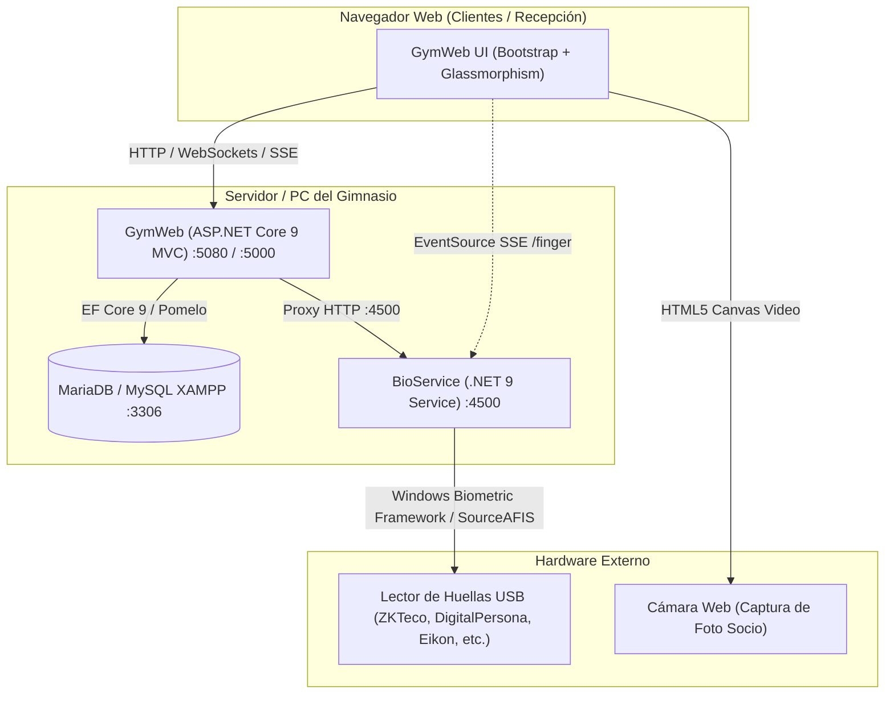

# 🏋️ Estado Actual, Estructura y Registro de Cambios — Sistema de Gestión para Gimnasio

**Autor:** Ing. Victor Hernández  
**Canal de YouTube:** [@SoluciónDigital360](https://www.youtube.com/@SoluciónDigital360)  
**Tecnología Base:** ASP.NET Core 9 MVC + .NET 9 + MariaDB / MySQL (XAMPP)  
**Licencia:** Apache License 2.0  
**Última Actualización:** Agosto 2026  

---

## 📌 1. Resumen Ejecutivo del Proyecto

El sistema es una plataforma integral para la administración comercial, control de acceso biométrico, membresías, inventario y reportes financieros de gimnasios. Cuenta con una arquitectura desacoplada y modular:



---

## 🏛️ 2. Estructura Completa del Repositorio

```
Gym/
├── Gym.sln                                  # Solución Visual Studio (.NET 9)
├── README.md                                # Ficha técnica general
├── ESTRUCTURA_Y_CAMBIOS.md                  # Manual de arquitectura, cambios y mantenimiento
├── PUBLICAR.bat                             # Generador de instaladores completos (Win / Mac)
├── GENERAR-PARCHE.bat                       # Launcher para empaquetar parches de actualización
├── generar_parche.ps1                       # Script PowerShell generador del parche incremental
├── License.txt                              # Licencia Apache 2.0
├── NOTICE                                   # Créditos y autoría
│
├── BD/                                      # 🗄️ Esquema y Scripts de Migración SQL
│   ├── gym.sql                              # Esquema base completo con datos iniciales
│   ├── gym_export.sql                       # Respaldo completo de la base de datos
│   ├── migracion_periodos_dias.sql          # Migración para soporte de duración en días
│   ├── fix_registro_socios_eliminados.sql   # Integridad referencial de visitas
│   └── migracion_template_biometrico.sql    # Campo template LONGBLOB en tabla socio_huella
│
├── GymWeb/                                  # 🌐 Aplicación Web Principal (ASP.NET Core 9 MVC)
│   ├── Program.cs                           # Startup, DI, DbContext, auto-migraciones y sesiones
│   ├── GymWeb.csproj                        # Configuración .NET 9 y paquetes NuGet
│   ├── appsettings.json                     # Conexión MySQL y configuración general
│   ├── appsettings.Development.json         # Configuración para entorno de desarrollo
│   ├── appsettings.Production.json          # Configuración para producción (puerto 5080)
│   ├── Controllers/                         # 14 Controladores MVC
│   │   ├── AuthController.cs                # Base con filtro de sesión activa
│   │   ├── SuperAdminController.cs          # Base con filtro para rol 'superadmin'
│   │   ├── AccountController.cs             # Login, Logout y auto-migración MD5 -> BCrypt
│   │   ├── HomeController.cs                # Dashboard principal con métricas y alertas
│   │   ├── SociosController.cs              # CRUD socios, webcam en vivo y membresía inline
│   │   ├── MembresiasController.cs          # Catálogo de membresías y vigencias
│   │   ├── PagosController.cs               # Registro de pagos, métodos y exportación CSV
│   │   ├── ProductosController.cs           # Inventario, stock mínimo y venta rápida POS
│   │   ├── RegistroController.cs            # Check-in de socios y cobro de visitas de día
│   │   ├── ReportesController.cs            # Cortes de caja diario/mensual, asistencias y CSV
│   │   ├── BiometricoController.cs          # Proxy HTTP hacia BioService (:4500)
│   │   ├── UsuariosController.cs            # Gestión de cuentas y roles de administradores
│   │   ├── ConfiguracionController.cs       # Personalización visual, logo y recordatorios
│   │   └── BackupController.cs              # Generación de respaldos .sql y limpieza de BD
│   ├── Models/                              # 22 Modelos EF Core y Vistas SQL
│   │   ├── GymContext.cs                    # DbContext principal de EF Core
│   │   ├── Socio.cs, Membresium.cs, ...     # Modelos de tablas de negocio
│   │   ├── SocioHuella.cs                   # Modelo biométrico (PIN + Template BLOB)
│   │   └── Vwsocio.cs, Vwusuario.cs, ...    # Modelos mapeados a Vistas SQL
│   ├── Views/                               # Vistas Razor con diseño Glassmorphism
│   ├── Helpers/                             # Clases auxiliares y AppSettings globales
│   └── wwwroot/                             # Assets estáticos (CSS, JS, fotos de socios)
│
├── BioService/                              # 👆 Microservicio Biométrico Universal (.NET 9)
│   ├── Program.cs                           # API REST, SSE (/finger), WinBio y SourceAFIS
│   ├── BioService.csproj                    # Proyecto .NET 9 con soporte Windows Service
│   ├── Backends/
│   │   ├── BackendSelector.cs               # Auto-detección del mejor backend disponible
│   │   ├── IFingerBackend.cs                # Interfaz abstracta para backends de captura
│   │   ├── WinBioBackend.cs                 # Conexión nativa con Windows Biometric Framework
│   │   ├── PinOnlyBackend.cs                # Fallback por PIN / Teclado numérico / Barcode
│   │   └── SourceAfisHelper.cs              # Algoritmo matemático de matching 1:1 y 1:N
│   ├── Tests/
│   │   └── DiagnosticTest.cs                # Suite de 7 pruebas sintéticas unitarias de huellas
│   ├── INICIAR-BioService.bat               # Launcher interactivo del servicio en puerto 4500
│   └── PROBAR-DIAGNOSTICO.bat               # Launcher para ejecutar la suite de diagnóstico
│
├── Publish/                                 # 🚀 Scripts de Despliegue e Instalación
│   ├── INSTALAR.bat                         # Instalador desatendido para Windows (Crea servicios)
│   ├── INSTALAR.command                     # Instalador para macOS
│   ├── ACTUALIZAR.bat                       # Launcher para aplicar parches en clientes
│   ├── actualizar.ps1                       # Lógica robusta de actualización sin pérdidas de datos
│   └── Iniciar GymWeb.bat                   # Acceso directo para levantar GymWeb
│
├── dist/                                    # 📦 Salidas Compiladas y Distribución
│   ├── GymWeb-Windows/                      # Paquete autocontenido listo para Windows x64
│   ├── GymWeb-Mac-AppleSilicon/             # Paquete autocontenido para Mac M1/M2/M3/M4
│   ├── Actualizacion-GymWeb/                # Archivos preparados para el parche
│   └── Parche_GymWeb_v2.0.zip               # ZIP final del parche incremental para clientes
│
├── zk9500-service/                          # 🟡 (Obsoleto) Anterior servicio Node.js
└── Gimnasio/                                # ⚪ (Legacy) Proyecto de escritorio WinForms
```

---

## 🔄 3. Registro Histórico de Versiones y Cambios

### 🔹 Versión 1.0 — Sistema Legacy de Escritorio
- Base de datos MySQL `gym` original.
- Aplicación de escritorio C# Windows Forms (.NET Framework 4.0).
- Lógica base de socios, membresías, productos y cobros directos.

### 🔹 Versión 1.5 — Migración Web (`GymWeb`)
- Reescritura completa en **ASP.NET Core 9 MVC** y **Entity Framework Core 9**.
- Diseño moderno Glassmorphism con tarjetas traslúcidas, gradientes y animaciones.
- Seguridad reforzada:
  - Manejo de sesiones seguras (`AuthController`).
  - Hashing de contraseñas con **BCrypt** (`BCrypt.Net-Next`) y migración transparente de hashes MD5 heredados.
  - Protección de vistas y rutas administrativas con `SuperAdminController`.

### 🔹 Versión 1.8 — Módulos Operativos y Reportes
- **Socios:** Captura de fotos en tiempo real con webcam (HTML5 Canvas Base64) o subida local.
- **Membresías:** Soporte flexible de vigencia en meses o días (`migracion_periodos_dias.sql`).
- **Punto de Venta e Inventario:** Control de stock con alertas mínimas, venta rápida y reabastecimiento AJAX.
- **Registro de Visitas:** Check-in ágil para socios y visitas de día para no socios con precio configurable.
- **Cortes y Reportes:** Generación de corte diario/mensual integrando membresías, productos y visitas, con exportación a CSV.
- **Respaldos:** Módulo de backups `.sql` mediante `mysqldump` y limpieza controlada de base de datos.

### 🔹 Versión 2.0 — Servicio Biométrico Universal (`BioService`)
- **Problema resuelto:** El servicio previo `zk9500-service` (Node.js) dependía de drivers específicos no portables y forzaba el modo de simulación en hardware real.
- **Nuevo `BioService` (.NET 9):**
  - Conexión universal mediante **Windows Biometric Framework (WBF)** para lectores USB (ZKTeco ZK9500/ZK4500, DigitalPersona U.are.U 4500/5100, Eikon, y sensores de huella integrados en laptops).
  - Algoritmo matemático **SourceAFIS** para extracción de vectores biométricos y matching 1:1 y 1:N.
  - Compatibilidad total con la API REST de `GymWeb` (`/status`, `/devices`, `/capture`, `/verify`, `/finger` vía Server-Sent Events).
  - Script de migración `BD/migracion_template_biometrico.sql` y auto-migración en `Program.cs`.
  - Suite de diagnóstico automatizada con 7 pruebas unitarias sintéticas ([PROBAR-DIAGNOSTICO.bat](file:///c:/xampp/htdocs/Gym%20(2)/Gym/BioService/PROBAR-DIAGNOSTICO.bat)).

### 🔹 Versión 2.0.1 — Corrección y Automatización del Parche de Actualización
- **Corrección de cierre prematuro:** Se resolvió el error de sintaxis en `cmd.exe` (`No se esperaba | en este momento`) separando la lógica del actualizador en [actualizar.ps1](file:///c:/xampp/htdocs/Gym%20(2)/Gym/Publish/actualizar.ps1) y [ACTUALIZAR.bat](file:///c:/xampp/htdocs/Gym%20(2)/Gym/Publish/ACTUALIZAR.bat).
- **Auto-registro como Servicio de Windows:** `BioService` ahora se instala y arranca automáticamente como Servicio de Windows en segundo plano, evitando que los administradores tengan que mantener una consola abierta.
- **Protección de Datos:** La actualización preserva 100% las configuraciones, credenciales de base de datos y socios registrados en los clientes.
- **Instalador Fresh:** Se actualizó [INSTALAR.bat](file:///c:/xampp/htdocs/Gym%20(2)/Gym/Publish/INSTALAR.bat) para que las instalaciones nuevas configuren ambos servicios (`GymWeb` y `BioService`) desde el inicio.

### 🌟 Versión 2.1.0 — Modo Autónomo SQLite y Ventana de Escritorio Nativa (App Mode)
- **Soporte Dual Inteligente (MySQL + SQLite):**
  - Detección dinámica de motor en `Program.cs`: clientes con MySQL de XAMPP continúan sin cambios ni riesgo de desconexión; clientes nuevos o migrados trabajan con base de datos local `gym.db`.
  - Corrección de llaves primarias en `GymContext.cs` eliminando `int(11)` para compatibilidad estricta con `INTEGER PRIMARY KEY AUTOINCREMENT` de SQLite.
- **Motor de Migración de Datos Zero-Loss (`MySqlToSqliteMigrator.cs`):**
  - Migración tabla por tabla de 13 entidades (socios con fotos en BLOB, templates biométricos, pagos, visitas, inventario y ventas) en transacciones atómicas seguras.
  - Sincronización automática de secuencias en `sqlite_sequence` para preservar el orden consecutivo de IDs.
  - Disponible tanto desde la Web (`/Backup`) como por CLI / batch (`MIGRAR-DATOS-MYSQL-A-SQLITE.bat`).
- **Paleta de Colores Dinámica (6 Temas Corporativos):**
  - Implementación de 6 esquemas de color: Cian Neón (`cyan`), Esmeralda (`emerald`), Naranja Fuego (`orange`), Púrpura Eléctrico (`purple`), Rojo Pasión (`red`) y Oro Deportivo (`gold`).
  - Selector visual interactivo en la barra superior (`topbar`) con icono de paleta, en la pantalla de Configuración y en el Login.
  - Almacenamiento persistente en `localStorage` con script anti-flicker en el `<head>` para cambio instantáneo sin parpadeos.
- **Modo Aplicación de Escritorio (App Window Nativo - Estilo Electron sin peso extra):**
  - Lanzador inteligente `Iniciar Gym.bat` y lanzador 100% silencioso `AbrirGym.vbs`.
  - Ejecución en ventana nativa aislada mediante Microsoft Edge / Chrome (`--app=http://localhost:5080`) sin barras de URL, pestañas ni botones del navegador.
  - Script `Crear Acceso Directo.bat` para anclar el icono oficial en el Escritorio del usuario con un solo clic.

---

## 📊 4. Estado Actual de Componentes

| Componente | Estado | Versión / Puerto | Función Principal |
|------------|:---:|------------------|-------------------|
| **`GymWeb`** | 🟢 **Operativo** | ASP.NET Core 9 (Puerto 5080 prod / 5000 dev) | Frontend MVC, control de socios, cobros, inventario y reportes. |
| **`BioService`** | 🟢 **Operativo** | .NET 9 (Puerto 4500) | Microservicio biométrico con WBF, SourceAFIS y eventos SSE. |
| **Base de Datos** | 🟢 **Estable** | MariaDB 10.4+ / MySQL | 12 tablas, 8 vistas SQL y auto-migraciones activas. |
| **Instalador Completo** | 🟢 **Listo** | Multiplataforma (`dist/GymWeb-Windows`) | Para instalaciones nuevas desde cero. |
| **Parche de Actualización** | 🟢 **Listo** | v2.0.1 (`dist/Parche_GymWeb_v2.0.zip`) | Para actualizar clientes en producción sin alterar su BD. |
| **`zk9500-service`** | 🟡 **Obsoleto** | Node.js | Reemplazado por `BioService`. |
| **`Gimnasio`** | ⚪ **Legacy** | .NET Framework 4.0 WinForms | Mantenido como referencia histórica. |

---

## 🛠️ 5. Guía para Futuras Modificaciones y Mantenimiento

### 🔨 A. Cómo Compilar y Publicar una Versión Completa Nueva
Para generar los instaladores completos para nuevas computadoras o clientes:
1. Ejecutar el archivo:
   ```cmd
   PUBLICAR.bat
   ```
2. El script compilará `GymWeb` y `BioService` en modo *self-contained* y generará las carpetas:
   - `dist/GymWeb-Windows/` (Listo para copiar y ejecutar `INSTALAR.bat` como Administrador).
   - `dist/GymWeb-Mac-AppleSilicon/` (Para macOS ARM64).
   - `dist/GymWeb-Mac-Intel/` (Para macOS Intel).

### 📦 B. Cómo Generar un Nuevo Parche para Clientes en Producción
Si realizas cambios en el código de `GymWeb` o `BioService` y necesitas enviar una actualización a gimnasios existentes:
1. Ejecutar el archivo:
   ```cmd
   GENERAR-PARCHE.bat
   ```
2. El script compilará los cambios y creará el archivo comprimido:
   - `dist/Parche_GymWeb_v2.0.zip`
3. Enviar dicho `.zip` al cliente. El cliente solo debe descomprimirlo y hacer clic derecho en `ACTUALIZAR.bat` ➔ *Ejecutar como administrador*.

### 🧪 C. Cómo Probar el Motor Biométrico sin un Lector Físico
Para verificar que el algoritmo de extracción y emparejamiento de huellas funciona correctamente en cualquier equipo:
1. Abrir una consola en `Gym/BioService` o hacer doble clic en:
   ```cmd
   BioService/PROBAR-DIAGNOSTICO.bat
   ```
2. El sistema ejecutará las 7 pruebas unitarias automáticas (generación sintética, extracción de minutiae, matching idéntico, rechazo de impostores, serialización y velocidad 1:N).

### 🗄️ D. Reglas para Modificaciones de Base de Datos
- **Nunca sobrescribir bases de datos en producción:** Al agregar nuevas columnas o tablas, crear siempre un script SQL de migración en la carpeta `BD/` con la cláusula `IF NOT EXISTS` o `ADD COLUMN IF NOT EXISTS`.
- **Auto-migraciones en `Program.cs`:** Si una columna es crítica para una nueva funcionalidad, agregar la sentencia de verificación en el bloque `try/catch` de auto-migración en `GymWeb/Program.cs`.

---

## 🖐️ Soporte Universal de Lectores de Huella (Detección Hot-Plug y Auto-Diagnóstico)

Se resolvió la incompatibilidad con diferentes lectores USB del mercado mediante una arquitectura abierta y auto-diagnóstica:

1. **Detección Dinámica en Caliente (`DynamicBackendSelector.cs`):**
   - El servicio ya no queda bloqueado en modo estático al arrancar. Si el cliente conecta o desconecta el lector USB mientras el sistema está abierto, se detecta y activa automáticamente.
2. **Escáner de Hardware PnP en Tiempo Real (`HardwareDetector.cs`):**
   - Analiza dispositivos USB y controladores WBF mediante WMI (`Win32_PnPEntity`). Identifica de inmediato familias DigitalPersona, ZKTeco, SecuGen y Windows Hello.
3. **Endpoint de Diagnóstico y Semáforo UI en GymWeb:**
   - En el modal de registro de huella de `Socios/Index.cshtml`, una barra de estado informa con semáforo (Verde, Amarillo, Gris) si el lector está listo o qué driver específico requiere.
4. **Corrección de Seguridad en Captura:**
   - Se integró el token antifalsificación CSRF (`FormData` con `__RequestVerificationToken`) en la llamada asíncrona de captura.
5. **Herramientas de Soporte Incluidas:**
   - [`PROBAR-LECTOR-USB.bat`](file:///c:/xampp/htdocs/Gym%20(2)%20-%20copia/Gym/PROBAR-LECTOR-USB.bat): Script de 1 clic para diagnóstico rápido de puertos USB y BioService.
   - [`GUIA_LECTORES_HUELLA.md`](file:///c:/xampp/htdocs/Gym%20(2)%20-%20copia/Gym/GUIA_LECTORES_HUELLA.md): Manual para soporte a clientes con las 3 opciones de lectores más populares del mercado.
6. **Validación de Persistencia y Limpieza:**
   - Flujo de captura y guardado de templates biométricos validado exitosamente en base de datos (`socio_huella`). El botón y endpoints de simulación temporal fueron removidos para dejar la interfaz 100% limpia y lista para producción.

---

## 🛒 Tienda POS E-Commerce (Módulo de Ventas Rediseñado v2.2)

Se transformó por completo el módulo administrativo tradicional de "Ventas" en una experiencia moderna tipo **E-COMMERCE + PUNTO DE VENTA (POS)** inspirada en aplicaciones fitness profesionales:

1. **Encabezado y Barra de Búsqueda:**
   - Título `🏋️ Tienda` con subtítulo `Productos y ventas del gimnasio`.
   - Buscador inteligente reactivo por nombre y categoría con atajo rápido de teclado `Ctrl + K`.
   - Indicador superior de carrito con contador de artículos y monto en tiempo real.
2. **4 Tarjetas de Resumen del Día (Métricas en Tiempo Real):**
   - **Ventas de hoy:** Total de transacciones completadas durante el día.
   - **Ingresos de hoy:** Monto total monetario recaudado en el día (en verde positivo).
   - **Productos vendidos:** Unidades físicas totales despachadas hoy.
   - **Stock bajo:** Alerta con la cantidad de productos con existencias por debajo del mínimo configurado.
3. **Filtros por Categoría:**
   - Selector en pastillas redondeadas con iconos: `Todos`, `Suplementos`, `Ropa`, `Equipo`, `Bebidas`, `Accesorios`, `Otros`, `Stock bajo` y switch `Solo con stock`.
4. **Catálogo de Productos E-Commerce:**
   - Tarjetas con iluminación neon y bordes redondeados.
   - Badges automáticos: `⚡ Más vendido`, `⚠️ Stock bajo`, `Agotado`.
   - SVGs vectoriales integrados en alta resolución según la categoría para productos sin fotografía.
   - Indicador visual de stock disponible y botón cyan `[ 🛒 Agregar al carrito ]`.
5. **Panel Lateral del Carrito POS:**
   - Carrito fijo/sticky en escritorio y drawer táctil en móvil.
   - Selector de cantidades reactivo `[ - 1 + ]` con validación de inventario máximo en tiempo real.
   - Botón de eliminación rápida y botón `Limpiar`.
   - Campo para aplicar descuentos opcionales y cálculo automático del total general.
   - Botón destacado `[ 💳 Cobrar venta ➔ ]`.
6. **Modal de Checkout y Cobro:**
   - Tres métodos de pago admitidos:
     - 💵 **Efectivo:** Calculadora de cambio en tiempo real con botones rápidos de billetes comunes ($50, $100, $200, $500, $1,000, Exacto) y bloqueo de confirmación si el importe es insuficiente.
     - 🏦 **Transferencia:** Registro de referencia/folio de operación y banco.
     - 💳 **Tarjeta:** Cobro con terminal física con captura de referencia/autorización.
   - Transacción atómica en base de datos (`Serializable`) que valida stock, crea la cabecera `salida`, partidas `detallesalida`, descuenta inventario y asigna folio correlativo (#000125).
7. **Confirmación y Detalle de Venta:**
   - Modal tipo ticket POS con check animado, folio, desglose y botones para "Nueva venta" o "Ver en historial".
   - Historial de ventas modernizado con tabla responsiva, badges por método de pago y modal con desglose completo de partidas.
8. **Integridad de Datos:**
   - Base de datos intacta (cero DROP TABLE); auto-migración segura con `ALTER TABLE salida ADD COLUMN ...` para almacenar método de pago, folio y cambio sin alterar ventas pasadas ni el producto `"Agua Ciel 1Lt"`.

---

## 🚀 Actualización Mayor v2.1 / v2.2: Modo Autónomo (SQLite), Visor Nativo y Licencias

### 1. Base de Datos Híbrida y Modo 100% Autónomo (SQLite `gym.db`):
* **Independencia de XAMPP:** El sistema ya no exige MySQL ni XAMPP para operar. Admite el motor local ultrarrápido SQLite empaquetado en el archivo `gym.db`.
* **Compatibilidad Dual Inteligente (`Program.cs`):** Al iniciar, el sistema analiza la cadena de conexión configurada en `appsettings.json`:
  * Si contiene `Server=` o `Database=`, activa el proveedor MySQL/MariaDB conectando a XAMPP sin alterar datos previos.
  * Si contiene `Data Source=`, activa SQLite en modo nativo con journaling WAL de alto rendimiento.
* **Migrador Seguro de MySQL a SQLite ([`MIGRAR-DATOS-MYSQL-A-SQLITE.bat`](file:///c:/xampp/htdocs/Gym%20(2)%20-%20copia/Gym/Publish/MIGRAR-DATOS-MYSQL-A-SQLITE.bat)):**
  * Herramienta con interfaz gráfica de consola que lee todas las tablas de MySQL mediante sentencias `SELECT` de solo lectura.
  * **Cero riesgo de pérdida:** En ningún momento ejecuta `DROP`, `DELETE` o `TRUNCATE` en MySQL. La base de XAMPP queda intacta como respaldo inmutable.
  * Copia 100% de datos binarios (fotos de socios en BLOB, huellas biométricas), cobros, catálogo, ventas y usuarios.
  * Sincroniza secuencias autoincrementales y actualiza automáticamente `appsettings.json` y `appsettings.Production.json` para pasar a SQLite en un solo clic.
* **Resolución Absoluta de Directorios (`AppContext.BaseDirectory`):**
  * Se blindó `Program.cs` con `Directory.SetCurrentDirectory(AppContext.BaseDirectory)` para evitar que servicios de Windows busquen la base de datos o logs en `C:\Windows\System32`.

### 2. Visor Nativo de Escritorio Autónomo y Auto-Reparable ([`Gym.exe`](file:///c:/xampp/htdocs/Gym%20(2)%20-%20copia/Gym/GymApp/Form1.cs)):
* **Compilación 100% Autocontenida (Self-Contained x64):**
  * `GymApp` incorpora las librerías de Windows Forms y Desktop Runtime. No solicita al cliente descargar `.NET Desktop Runtime 9.0`.
* **Auto-Detección y Levantamiento en Segundo Plano:**
  * Si el usuario abre el acceso directo y el backend `GymWeb.exe` o `BioService.exe` no están corriendo (porque no se instaló el servicio de Windows o la máquina se reinició), `Gym.exe` **los inicia automáticamente de forma invisible**.
* **Pantalla de Carga Oscura (Cero Errores `ERR_CONNECTION_REFUSED`):**
  * Mientras el servidor local e inicialización de SQLite arrancan, muestra una pantalla de bienvenida oscura (`#0f141c`) con branding en cian: *"Iniciando Sistema del Gimnasio..."*.
  * Monitorea la conexión en el puerto `5080` (con fallback a `5250`) y solo despliega la vista una vez que el servidor responde HTTP 200/302.
  * Incluye reintento automático y botón de reconexión manual.
* **Unificación de Puertos:** Puerto oficial estandarizado en `5080` en toda la solución (`appsettings.json`, `appsettings.Production.json`, `INSTALAR.bat` y `Form1.cs`).

### 3. Sistema de Licenciamiento y Período de Prueba:
* **Seguridad por Hardware (`PC ID`):**
  * El sistema calcula un identificador criptográfico único atado a la placa base, CPU y RAM del equipo del cliente.
* **Bloqueo Inteligente tras 7 días:**
  * Pasados los 7 días de demo, el middleware restringe el acceso a las funciones operativas y redirige amigablemente a la pantalla de Activación de Licencia.
  * En dicha pantalla, el cliente puede consultar su PC ID y presionar el botón directo de WhatsApp hacia el administrador (`529611209361`).
* **Generador Externo ([`generador-licencias-gym.html`](file:///c:/xampp/htdocs/Gym%20(2)%20-%20copia/Gym/generador-licencias-gym.html)):**
  * Herramienta web cliente para generar claves de prueba (`GYM7-...`) o vitalicias (`GYM-...`).
* **Preservación Total de Datos en Producción:**
  * Al ingresar la licencia vitalicia, todos los socios, fotos, cobros y configuraciones capturados en los días de prueba permanecen 100% intactos.

---

## 📋 Reglas Estrictas para Generación de Parches e Instaladores (Guía para Agentes y Desarrolladores)

Todo agente o desarrollador que trabaje en este proyecto **DEBE RESPETAR ESTRICTAMENTE** las siguientes directrices para evitar pérdida de datos o enviar archivos innecesarios a clientes:

### 🛡️ REGLAS DE ORO DE PROTECCIÓN DE DATOS DEL CLIENTE:
1. **JAMÁS incluir `gym.db` en un Parche ni en el Instalador limpio:**
   * En el **Instalador nuevo**, la base debe crearse virgen en el primer arranque.
   * En un **Parche**, si se sobreescribe `gym.db`, se destruirían los socios y cobros reales del gimnasio.
2. **JAMÁS sobreescribir `appsettings.json` ni `appsettings.Production.json` en un Parche:**
   * Cada cliente tiene su propia configuración (cadena de conexión MySQL o SQLite, credenciales y puerto). El parche debe preservar estos archivos intactos.
3. **JAMÁS incluir `wwwroot/img/socios/` ni `logo-custom.png` en un Parche:**
   * Estos directorios contienen las fotos de los socios del gimnasio y el logo del negocio.
4. **Garantizar que MySQL permanezca intacto:**
   * Los scripts de actualización o migración nunca deben ejecutar `DROP DATABASE`, `DROP TABLE` ni `DELETE` en MySQL. La migración a SQLite es opcional y solo realiza `SELECT`.

---

### 📦 TIPOS DE PARCHES Y CÓMO GENERARLOS:

#### Tipo A: Micro-Parche Ligero de Código / Vistas (~2 MB) — *El más común*
* **¿Cuándo usarlo?** Cuando solo se modifica código en C# (controladores, modelos, servicios), vistas Razor (`.cshtml`), o reportes.
* **Principio Técnico:** En ASP.NET Core (.NET 9), **todas las vistas Razor, controladores y modelos se compilan dentro de un solo archivo binario: `GymWeb.dll`**.
* **Archivos que componen el Micro-Parche:**
  ```
  📁 Parche_Ligero_vX.X/
     ├── GymWeb.dll          (~1.8 MB - Todo el sistema compilado)
     ├── ACTUALIZAR.bat      (Detiene GymWeb, reemplaza el DLL y reinicia el servicio)
     └── wwwroot/            (OPCIONAL: Solo si se cambiaron archivos CSS/JS/imágenes estáticas)
  ```
* **Herramienta:** Ejecutar [`GENERAR-PARCHE-LIGERO.bat`](file:///c:/xampp/htdocs/Gym%20(2)%20-%20copia/Gym/GENERAR-PARCHE-LIGERO.bat). Genera `dist/Parche_Ligero_GymWeb.zip` listo para mandar por WhatsApp en 2 segundos.

#### Tipo B: Parche Mayor de Arquitectura (~150 MB)
* **¿Cuándo usarlo?** Solo cuando se actualizan componentes pesados del sistema operativo:
  * Modificaciones al visor de escritorio `Gym.exe` (WebView2, Forms autocontenido).
  * Nuevas versiones del microservicio `BioService.exe` o drivers de huella.
  * Nuevos scripts de instalación de servicios de Windows.
* **Herramienta:** Ejecutar [`GENERAR-PARCHE.bat`](file:///c:/xampp/htdocs/Gym%20(2)%20-%20copia/Gym/GENERAR-PARCHE.bat) o `generar_parche.ps1`. Genera `dist/Parche_GymWeb_v2.1.zip`.

#### Tipo C: Instalador Completo para Clientes Nuevos (~120 MB)
* **¿Cuándo usarlo?** Para entregar el sistema a un cliente nuevo que lo instalará desde cero.
* **Características obligatorias:**
  * 100% Autocontenido x64 (no requiere instalar .NET, XAMPP ni MySQL).
  * Sin archivo `license.json` (inicia en modo de prueba de 7 días y muestra el PC ID).
  * Sin archivo `gym.db` (autogenera base virgen de 0 socios).
  * Sin logos ni fotos de prueba.
* **Herramienta:** Ejecutar `generar_instalador.ps1`. Genera `dist/Instalador_GymWeb_Windows_v2.1.zip`.


